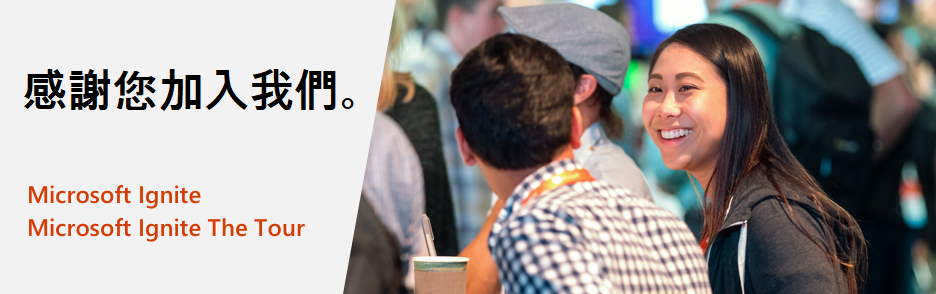

# Microsoft Ignite and Microsoft Ignite The Tour: 免費認證測驗優惠

<em><strong>2020 年 3 月 26 日更新:</strong> 針對冠狀病毒(COVID-19)，Microsoft 將測驗優惠延長至2021年1月31日。這意味著這些活動提供的認證測驗優惠原本有效期為180天，現在有效期至 2021 年 1 月 31 日。<a href="https://aka.ms/covid-19certannoucement"> 學到更多</a>.此變更反映在下面的詳細資訊中。</em>

感謝您參加 Microsoft Ignite 2019 或 Microsoft Ignite The Tour 2019-2020 活動。 親自參加活動的所有出席者都將獲得免費的認證測驗，但需遵循 [條款和條件](#terms-and-conditions)，以幫助您繼續提升技能並向雇主和同行證明您的技術專長。

## 優惠詳細資料

如果您親自參加了 Microsoft Ignite 2019 或 Microsoft Ignite The Tour 2019-2020 活動，則可能有資格獲得一項免費的 Microsoft 基礎知識，role-based 或專業認證測驗。’免費的測驗優惠可從您參加的活動開始之日起兌換，有效期至2021年1月31日。如果您未在該時間範圍內安排參加合格測驗，則將無法兌換您的優惠。

##  如何取得免費測驗

以下是有關如何取得免費考試的逐步說明。

**第 1 步：** 選擇任何一項 [合格測驗](#eligible-exams-for-this-offer) ，然後按一下“安排測驗”按鈕以開始線上註冊流程。  

**第 2 步：** 登入到現有的 Microsoft 認證個人資料或使用 Microsoft 帳戶建立一個。  

**第 3 步：** 一旦登錄，請確定認證個人資料中的詳細資訊正確無誤。  

**第 4 步：** 在證書個人資料頁面底部按一下"儲存並繼續按鈕”，以繼續 '測驗折扣' 頁面。  

**第 5 步：** 在“測驗折扣”頁面上，輸入用於註冊活動的電子郵件(例如 alias@company.com 或 alias@outlook.com)。  

**第 6 步：** 如果您有資格取得測驗折扣，您將收到一封確認電子郵件，其中包含您輸入的地址。您必須輸入在電子郵件中收到的密碼才能繼續。如果您沒有收到電子郵件，則可以重新發送代碼。  

**第 7 步：** 輸入正確的密碼後，系統會要求您關聯您的帳戶。您必須同意關聯您的帳戶以取得折扣。  

下次登錄時，如果您有資格取得其中一個帳戶的測驗折扣，則折扣將自動顯示。要移除帳戶，請轉到[認證儀錶板](https://aka.ms/certdashboard) ，然後按一下“編輯您的認證資料”。

**第 8 步：** 您會在頂部看到折扣彈出。選擇您要申請的折扣，然後按一下安排測驗按鈕以此繼續並結帳。  

**第 9 步：** 按照後續熒幕上的步驟進行操作，並提供所需的詳細資訊以安排您的測驗。在結帳過程中，驗證應付款總額為 $0.00 並提交訂單。  

**認證支援：**

關於安排測驗的問題，請透過 [Microsoft認證支援論壇](https://trainingsupport.microsoft.com/mcp/forum?sort=LastReplyDate&dir=Desc&tab=All&status=all&mod=&modAge=&advFil=&postedAfter=&postedBefore=&threadType=All&isFilterExpanded=false&page=1) 獲得協助。論壇版主將在一個工作日內回覆。

##  符合此優惠條件的測驗

此優惠涵蓋了所有 Microsoft 基本知識、role-based 和專業化認證測驗。符合條件的測驗如下所示。

| 按產品| 測驗 |
| --- | --- |
| Azure | [AI-100: Designing and Implementing an Azure AI Solution](/learn/certifications/exams/ai-100) [AI-900: Microsoft Azure AI Fundamentals](/learn/certifications/exams/ai-900) [AZ-104: Microsoft Azure Administrator](/learn/certifications/exams/az-104) [AZ-120: Planning and Administering Microsoft Azure for SAP Workloads](/learn/certifications/exams/az-120) [AZ-204: Developing Solutions for Microsoft Azure](/learn/certifications/exams/az-204) [AZ-220: Microsoft Azure IoT Developer](/learn/certifications/exams/az-220) [AZ-303: Microsoft Azure Architect Technologies](/learn/certifications/exams/az-303) [AZ-304: Microsoft Azure Architect Design](/learn/certifications/exams/az-304) [AZ-400: Designing and Implementing Microsoft DevOps Solutions](/learn/certifications/exams/az-400) [AZ-500: Microsoft Azure Security Technologies](/learn/certifications/exams/az-500) [AZ-900: Microsoft Azure Fundamentals](/learn/certifications/exams/az-900) [DA-100: Analyzing Data with Microsoft Power BI](/learn/certifications/exams/da-100) [DP-100: Designing and Implementing a Data Science Solution on Azure](/learn/certifications/exams/dp-100) [DP-200: Implementing an Azure Data Solution](/learn/certifications/exams/dp-200) [DP-201: Designing an Azure Data Solution](/learn/certifications/exams/dp-201) [DP-300: Administering Relational Databases on Microsoft Azure](/learn/certifications/exams/dp-300) [DP-900: Microsoft Azure Data Fundamentals](/learn/certifications/exams/dp-900) |
| Dynamics 365 and Power Platform | [MB-200: Microsoft Power Platform + Dynamics 365 Core](/learn/certifications/exams/mb-200) [MB-210: Microsoft Dynamics 365 Sales](/learn/certifications/exams/mb-210) [MB-220: Microsoft Dynamics 365 Marketing](/learn/certifications/exams/mb-220) [MB-230: Microsoft Dynamics 365 Customer Service](/learn/certifications/exams/mb-230) [MB-240: Microsoft Dynamics 365 Field Service](/learn/certifications/exams/mb-240) [MB-300: Microsoft Dynamics 365: Core Finance and Operations](/learn/certifications/exams/mb-300) [MB-310: Microsoft Dynamics 365 Finance](/learn/certifications/exams/mb-310) [MB-320: Microsoft Dynamics 365 Supply Chain Management, Manufacturing](/learn/certifications/exams/mb-320) [MB-330: Microsoft Dynamics 365 Supply Chain Management](/learn/certifications/exams/mb-330) [MB-400: Microsoft Power Apps + Dynamics 365 Developer](/learn/certifications/exams/mb-400) [MB-500: Microsoft Dynamics 365: Finance and Operations Apps Developer](/learn/certifications/exams/mb-500) [MB-600: Microsoft Dynamics 365 + Power Platform Solution Architect](/learn/certifications/exams/mb-600) [MB-700: Microsoft Dynamics 365: Finance and Operations Apps Solution Architect](/learn/certifications/exams/mb-700) [MB-901: Microsoft Dynamics 365 Fundamentals](/learn/certifications/exams/mb-901)  [PL-100: Microsoft Power Platform App Maker](/learn/certifications/exams/pl-100) [PL-200: Microsoft Power Platform Functional Consultant](/learn/certifications/exams/pl-200) [PL-400: Microsoft Power Platform Developer](/learn/certifications/exams/pl-400) [PL-900: Microsoft Power Platform Fundamentals](/learn/certifications/exams/pl-900) |
| Microsoft 365 | [MD-100: Windows 10](/learn/certifications/exams/md-100) [MD-101: Managing Modern Desktops](/learn/certifications/exams/md-101) [MS-100: Microsoft 365 Identity and Services](/learn/certifications/exams/ms-100) [MS-101: Microsoft 365 Mobility and Security](/learn/certifications/exams/ms-101) [MS-203: Microsoft 365 Messaging](/learn/certifications/exams/ms-203) [MS-500: Microsoft 365 Security Administration](/learn/certifications/exams/ms-500) [MS-600: Building Applications and Solutions with Microsoft 365 Core Services](/learn/certifications/exams/ms-600) [MS-700: Managing Microsoft Teams](/learn/certifications/exams/ms-700) [MS-900: Microsoft 365 Fundamentals](/learn/certifications/exams/ms-900) |

## 常問問題：

### 關於優惠

**問: 此優惠可以免費安排多少測驗？**

**答案：** 您可以透過此優惠取得一次免費的合格認證測驗。就算您參與了多個Microsoft Ignite優惠，您也只能獲得1次免費測驗。

**問: 哪些認證測驗可以使用此優惠？**

**答案：** 此優惠涵蓋了所有 Microsoft 基本知識、role-based 和專業化認證測驗。關於合格的認證測驗清單，請參見我們的優惠詳細資訊頁面上的“此優惠的合格測驗”部分：[https://docs.microsoft.com/learn/certifications/microsoft-ignite-free-certification-exam-offer#eligible-exams-for-this-offer](https://docs.microsoft.com/learn/certifications/microsoft-ignite-free-certification-exam-offer#eligible-exams-for-this-offer).

**問: 如果我報名參加一項合格的活動但沒有親自參加，我仍然可以領取此優惠嗎？**

**答案：** 不，本測驗優惠僅適用於親自參加 Microsoft Ignite 2019 或 Microsoft Ignite The Tour 2019-2020 活動的合格個人。

**問: 如果我註冊了某次適用優惠的活動，但是該活動被取消，那我是否還能繼續享受此優惠？**

**答案：** 不能!認證測驗優惠只是一次現場體驗的擴展，如果活動被取消了，那認證測驗也無法繼續提供。但是我們仍然鼓勵您透過 [Microsoft Learn](https://docs.microsoft.com/learn/)繼續學習，獲得免費，交互式的培訓!

**問: 為什麼此次優惠的條款裡面特別說明了以色列，德國和瑞典的公民無法參加？**

**答案：** 由於Microsoft的贈送政策和當地法律，這些地區的居民沒有資格獲得此優惠。這些國家/地區都有專門的法律，限制任何公司可以贈送給居民禮品，並且我們的認證測驗的價值超出限制，因此，Microsoft 無法為這些國家/地區的居民提供免費測驗。

### 安排免費測驗

**問: 在我參加或計劃參加的活動期間，是否需要透過此優惠安排免費測驗？**

**答案：** 不，您無需在參加的活動中安排透過此優惠計劃進行的免費測驗。您可以在活動期間或活動結束後安排測驗；參加免費測驗，此優惠將於 2021 年 1 月 31 日到期。

**問: 我需要在 2021 年 1 月 31 日或之前參加測驗嗎？**

**答案：** 是的，您確實需要在 2021 年 1 月 31 日或之前參加考試。

**問: 如何透過此優惠安排免費測驗？**

**答案：** 關於如何安排免費測驗的說明，請前往 [https://docs.microsoft.com/learn/certifications/microsoft-ignite-free-certification-exam-offer#how-to-claim-your-free-exam](https://docs.microsoft.com/learn/certifications/microsoft-ignite-free-certification-exam-offer#how-to-claim-your-free-exam).

**問: 在驗證我的測驗折扣資格時，我遇到一個錯誤，指出我不符合條件，因為我是政府官員，但我不是。我該怎麼辦？**

**答案：** 如果您被錯誤識別為政府官員，則需要在活動註冊個人資料中更新“政府”欄位，並等到活動結束後才能看見資格。您也可以聯絡 [Microsoft 認證支援論壇](https://trainingsupport.microsoft.com/mcp/forum?sort=LastReplyDate&dir=Desc&tab=All&status=all&mod=&modAge=&advFil=&postedAfter=&postedBefore=&threadType=All&isFilterExpanded=false&page=1) ([https://aka.ms/CertificationSupport](https://aka.ms/CertificationSupport))。

**問: 我在安排免費測驗時遇到麻煩。我可以在哪裡獲得支援？**

**答案：** 透過 [Microsoft 認證支援論壇](https://trainingsupport.microsoft.com/mcp/forum?sort=LastReplyDate&dir=Desc&tab=All&status=all&mod=&modAge=&advFil=&postedAfter=&postedBefore=&threadType=All&isFilterExpanded=false&page=1) 獲得幫助 ([https://aka.ms/CertificationSupport](https://aka.ms/CertificationSupport))。版主將在一個工作日內回覆。

**問: 我可以選擇親自或線上參加排定的測驗嗎？**

**答案：** 是的，您可以選擇透過當地的考試中心親自通過Pearson Vue或透過線上監考(OP)參加排定的測驗。要瞭解關於線上測驗的更多資訊，請前往
[https://docs.microsoft.com/learn/certifications/online-exams](/learn/certifications/online-exams)

### 取消和重新安排規定

**問: 如果需要，我可以透過此優惠重新安排測驗預約嗎？**

**答案：** 是的，您可以重新安排測驗預約，但是必須在優惠期滿前重新安排。[請參閱重新安排原則](/learn/certifications/certification-exam-policies#cancellation-and-reschedule-policy) 以獲取更多資訊。

**問: 重新安排或取消測驗預約時需要付費嗎？**

**答案：** 如果您在預約前至少六個工作日重新安排或取消測驗預約，則不會收取任何費用。如果您在測驗時間前五個工作日內需要重新安排，則需要支付重新安排費用。如果您在排定的測驗時間的兩天內，則可能不會重新安排或取消測驗。如果您未能在預定的測驗時間出現，那麼您將失去此優惠的免費測驗。欲瞭解更多，請查看 [取消和重新安排政策](/learn/certifications/certification-exam-policies#cancellation-and-reschedule-policy).

**問: 如果我錯過了測驗預約，並且沒有重新安排或取消測驗，會發生什麼？**

**答案：** 如果您已經錯過測驗預約，並且沒有在排定的預約至少24小時之前重新安排或取消預約，則您將失去此優惠的免費測驗。欲瞭解更多，請查看 [取消和重新安排政策](/learn/certifications/certification-exam-policies#cancellation-and-reschedule-policy).

### 重考規定

**問: 如果最初沒有使用免費認證測驗優惠，我可以免費重考嗎？**

**答案：** 不可以，此優惠僅適用於一次使用，必須單獨重新安排測驗重考。關於重考認證測驗的更多資訊，請參閱我們的 [測驗重考規定](/learn/certifications/certification-exam-policies#security-policies).

##  條款與條件

- 本測驗優惠適用於已參加 Microsoft Ignite 2019 或 Microsoft Ignite The Tour 2019-2020 活動的合格個人。
- 此測驗優惠可兌換參加一 (1) 次 Microsoft Certification 測驗，測驗地點為經授權的 Pearson Vue 測驗中心或 Pearson Vue 在線監考網站。
- 此測驗優惠僅限測驗使用，且只能兌換選定的 Microsoft 測驗。
- 本測驗優惠的有效期從您收到測驗優惠活動的第一天開始，直到 2021 年 1 月 31 日為止。
- 本測驗優惠使您可以在優惠到期日之前註冊和參加一(1)項測驗。
- 此測驗優惠的到期日在任何情況下都不能延長。
- 此測驗優惠對符合下列條件的人員無效(不可兌換)：1) 公務人員，或者 2) 以色列，德國和瑞典公民。 * 本優惠不適用於 **所提到** 國家的政府官員或居民，因為該優惠超出了 Microsoft 政策和當地法律允許的限制。
- 此測驗優惠僅可兌換一次。 
- 此測驗優惠不得兌換現金、點數或退款。
- 此測驗優惠不可轉讓，如果您以任何方式更改、修改或轉讓，則該優惠無效。

有關更多資訊，請參閱完整的 [Microsoft 使用條款](https://www.microsoft.com/en-us/legal/intellectualproperty/copyright/default.aspx?SilentAuth=1)。
